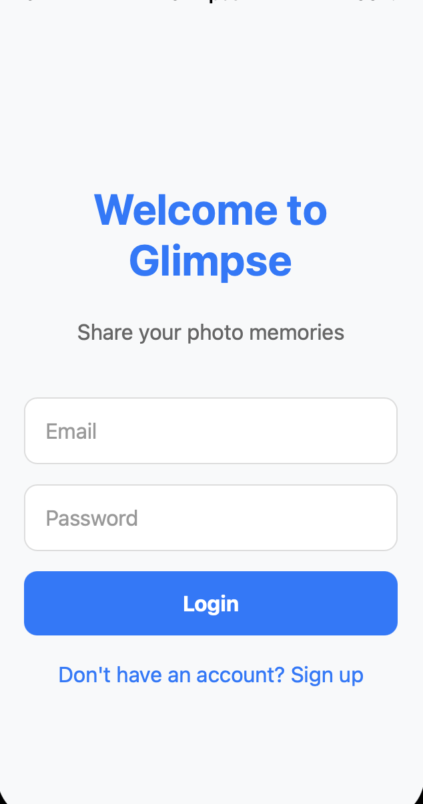
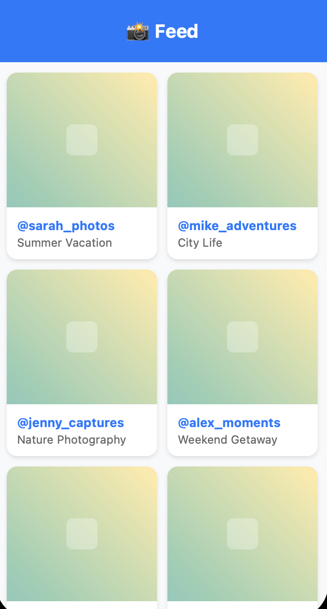
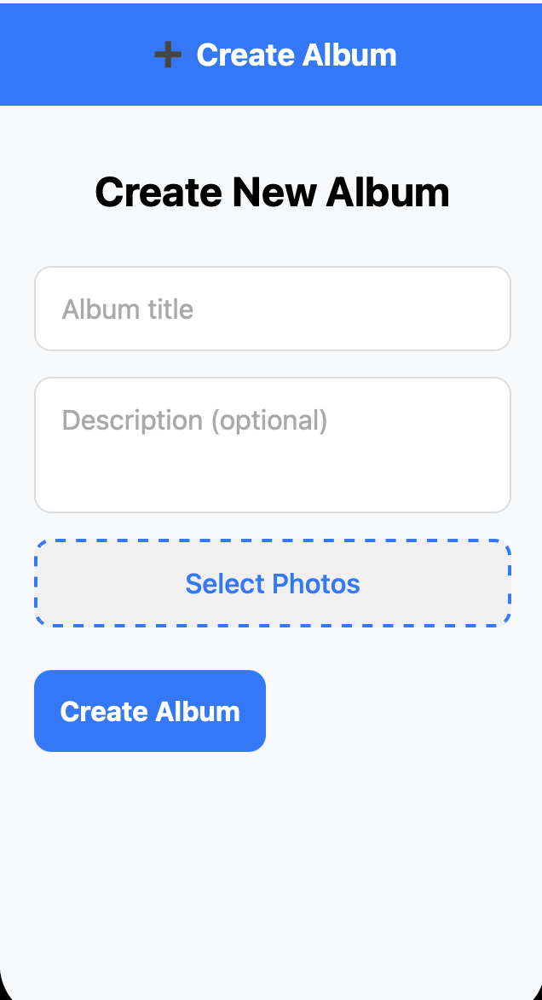
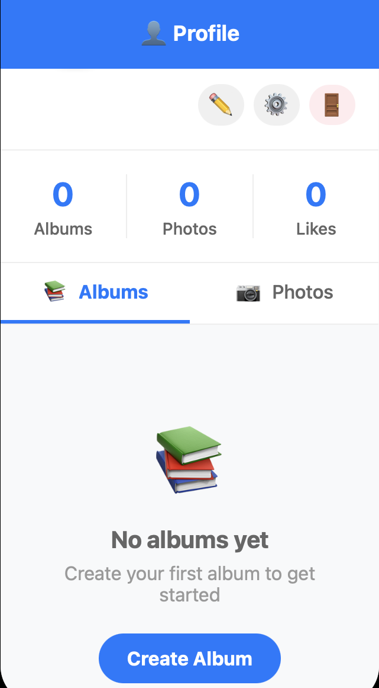

# Glimpse - Photo Sharing Mobile App

## Design and Purpose

**Glimpse** is a React Native photo-sharing mobile application designed to function as a streamlined photo dump platform. The app targets casual photographers, social media users, and friend groups who want a simple way to share collections of photos without the complexity of traditional photo management apps.

### Intended Use
Users can create albums and effortlessly post pictures that others can view through an intuitive swipe-based interface, similar to stories on popular social platforms. The key differentiator is that whenever a user posts a photo in their album, it appears on others' feeds individually, and viewers can click to access the complete album.

### Target Audience
- Casual photographers looking for easy photo sharing
- Social media users wanting a focused photo experience
- Friend groups and families sharing memories
- Anyone seeking a clean, gesture-based photo viewing experience

## Screenshots

### Login Screen
*Login interface with email/password authentication and link to registration*



### Main Feed
*Grid layout showing photos from all users with username and album information*



### Album Creation
*Interface for creating new albums with title, description, and batch photo upload*



### Photo Viewer
*Swipe-through photo viewer with like/comment functionality*


### User Profile
*Profile screen showing user statistics, albums, and photos with tab navigation*



*Note: Screenshots demonstrate the app's interface including navigation between screens, photo grid layouts, swipe gestures, social interaction features, and responsive design across different screen sizes.*

## Server API Design and Specification

The application utilizes Firebase as the backend service, providing authentication, database, and storage capabilities. All API communications are fully integrated into the app through Firebase SDK.

### Firebase Services Integration

#### Authentication API
**Endpoint**: Firebase Authentication Service  
**Methods**: 
- **POST** - User Registration
  - **Parameters**: `email` (string), `password` (string), `username` (string)
  - **Example**: 
  ```javascript
  await auth().createUserWithEmailAndPassword(email, password);
  await firestore().collection('users').doc(user.uid).set({
    username,
    email,
    createdAt: firestore.FieldValue.serverTimestamp()
  });
  ```

- **POST** - User Login
  - **Parameters**: `email` (string), `password` (string)
  - **Example**:
  ```javascript
  await auth().signInWithEmailAndPassword(email, password);
  ```

#### Firestore Database API
**Endpoint**: Cloud Firestore Database  
**Collections**: `users`, `albums`, `photos`, `comments`

- **GET/POST** - Albums Management
  - **Method**: Real-time listeners and CRUD operations
  - **Parameters**: `userId`, `title`, `description`, `photoCount`
  - **Example**:
  ```javascript
  // Create Album
  const albumRef = await firestore().collection('albums').add({
    title: "My Album",
    userId: user.uid,
    createdAt: firestore.FieldValue.serverTimestamp()
  });
  
  // Get User Albums
  const albums = await firestore()
    .collection('albums')
    .where('userId', '==', userId)
    .orderBy('createdAt', 'desc')
    .get();
  ```

- **GET/POST** - Photos Management
  - **Method**: CRUD operations with metadata
  - **Parameters**: `albumId`, `imageUrl`, `thumbnailUrl`, `metadata`
  - **Example**:
  ```javascript
  // Add Photo
  await firestore().collection('photos').add({
    albumId,
    userId,
    imageUrl,
    metadata: { originalName, size },
    likes: [],
    likeCount: 0,
    createdAt: firestore.FieldValue.serverTimestamp()
  });
  ```

- **GET/POST** - Social Features
  - **Method**: Real-time updates for likes and comments
  - **Parameters**: `photoId`, `userId`, `text`
  - **Example**:
  ```javascript
  // Toggle Like
  const photoRef = firestore().collection('photos').doc(photoId);
  await firestore().runTransaction(async (transaction) => {
    const photoDoc = await transaction.get(photoRef);
    const likes = photoDoc.data().likes || [];
    const newLikes = likes.includes(userId) 
      ? likes.filter(id => id !== userId)
      : [...likes, userId];
    transaction.update(photoRef, { 
      likes: newLikes, 
      likeCount: newLikes.length 
    });
  });
  ```

#### Firebase Storage API
**Endpoint**: Firebase Cloud Storage  
**Method**: File upload and retrieval

- **POST** - Photo Upload
  - **Parameters**: `imageUri`, `photoId`
  - **File Constraints**: Max 10MB, image formats only
  - **Example**:
  ```javascript
  const reference = storage().ref(`photos/${photoId}`);
  await reference.putFile(imageUri);
  const downloadURL = await reference.getDownloadURL();
  ```

### API Integration Architecture
All Firebase services are accessed through a centralized `FirebaseService` class that provides:
- Error handling and data validation
- Consistent response formatting
- Real-time data synchronization
- Offline capability support
- Transaction management for data consistency

The app uses Firebase SDK's real-time listeners to provide instant updates across all connected clients, ensuring users see new photos, likes, and comments immediately.

## Experiences

### Design and Development Process

#### Technology Choices
I chose React Native with Firebase for this project to leverage:
- **Cross-platform development** - Single codebase for iOS and Android
- **Real-time capabilities** - Firebase's live data synchronization
- **Rapid prototyping** - Firebase's backend-as-a-service approach
- **Modern UI patterns** - React Navigation and gesture-based interactions

#### Major Challenges and Solutions

**Challenge 1: Navigation Architecture**
- **Issue**: Implementing complex nested navigation with tab navigation, stack navigation, and modal presentations
- **Solution**: Used React Navigation 6 with proper screen hierarchy and parameter passing between screens
- **Implementation**: Created separate stack navigators for authentication and main app flows

**Challenge 2: Firebase Integration**
- **Issue**: Setting up Firebase services with proper security rules and real-time data synchronization
- **Solution**: Implemented Firebase emulators for development and comprehensive security rules for production
- **Code Pattern**: 
```javascript
// Centralized Firebase service layer
export class FirebaseService {
  static async createAlbum(albumData) {
    try {
      const albumRef = await firestore().collection('albums').add({
        ...albumData,
        createdAt: firestore.FieldValue.serverTimestamp()
      });
      return albumRef.id;
    } catch (error) {
      throw new Error(`Failed to create album: ${error.message}`);
    }
  }
}
```

**Challenge 3: Image Handling and Performance**
- **Issue**: Managing large image uploads and ensuring smooth scrolling in photo grids
- **Solution**: Implemented image compression, thumbnail generation, and lazy loading with React Native Fast Image
- **Optimization**: Used FlatList with optimized rendering for large photo collections

**Challenge 4: Real-time Social Features**
- **Issue**: Implementing likes and comments with immediate UI updates
- **Solution**: Used Firestore transactions for data consistency and real-time listeners for UI updates
- **Pattern**: Optimistic UI updates with rollback on failure

#### Modules and Techniques Adopted

**State Management**: Context API with useReducer for global authentication state
```javascript
const AuthContext = createContext();
export const useAuth = () => useContext(AuthContext);
```

**Custom Hooks**: Created reusable hooks for Firestore data fetching
```javascript
export const useCollection = (collectionName, queryConstraints) => {
  const [data, setData] = useState([]);
  const [loading, setLoading] = useState(true);
  // Real-time listener implementation
};
```

**Component Architecture**: Modular, reusable components with clear separation of concerns
- PhotoGrid for consistent photo layouts
- PhotoInteractions for social features
- Centralized navigation configuration

#### Coding Best Practices

1. **Error Boundaries**: Implemented comprehensive error handling
2. **Loading States**: Added skeleton screens and activity indicators
3. **Accessibility**: Proper contrast ratios and semantic markup
4. **Performance**: Image optimization and lazy loading
5. **Security**: Firebase security rules and input validation
6. **Code Organization**: Feature-based folder structure

#### Development Tools Used
- **Firebase Emulators**: Local development and testing
- **React Native Debugger**: Performance monitoring
- **ESLint/Prettier**: Code quality and formatting
- **Git**: Version control with feature branches

### Future Plans

#### Short-term Enhancements
- **Push Notifications**: Real-time alerts for new likes and comments
- **Image Filters**: Basic photo editing capabilities
- **Search Functionality**: Find photos by tags or users
- **Offline Support**: Enhanced offline photo caching

#### Long-term Vision
- **Social Network Features**: Follow users, private albums
- **Advanced Analytics**: User engagement metrics
- **Web Application**: React web version with shared codebase
- **AI Integration**: Auto-tagging and photo organization

### Key Learnings
This project provided hands-on experience with:
- Modern React Native development patterns
- Firebase backend integration and real-time databases
- Mobile UI/UX design principles
- Cross-platform mobile development challenges
- Performance optimization for media-heavy applications

The development process reinforced the importance of planning architecture early, implementing proper error handling, and prioritizing user experience in mobile applications.
